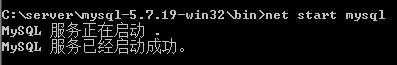

## <center>MySQL参考手册</center>

> ### Windows下安装MySQL（mysql-5.7.19-win32.zip/免安装版本）

1. [mysql官网](https://dev.mysql.com/downloads/mysql/)下载mysql-5.7.19-win32.zip包，解压到指定目录


2. (非管理员用户以管理员运行 CMD) DOS命令行进入mysql的目录

	

3. 安装mysql服务```mysqld -install```

	

4. 初始化data目录```mysqld --initialize-insecure``` 或 ```mysqld --initialize```

	
	
	<p style="background-color:#f4f4f4;padding:5px;color:#555;"><span style="color:red;">注：</span>5.7版本解压后不含data文件；mysqld --initialize-insecure自动生成无密码的root用户，mysqld --initialize自动生成带随机密码的root用户。data文件夹不为空不能执行这个命令，需要先删除data目录。</p>

5. 新建配置文件my.ini
```mysql
[client]
port=3306
default-character-set=utf8
[mysqld]
port=3306
character_set_server=utf8
basedir=替换为你的mysql根目录
datadir=替换为你的mysql data目录
sql_mode=NO_ENGINE_SUBSTITUTION,STRICT_TRANS_TABLES
[WinMySQLAdmin]
C:\server\mysql-5.7.19-win32\bin\mysqld.exe
```
	[my.ini下载地址](./images/mysql/my.ini)
	[配置信息详解](http://www.cnblogs.com/Ray-xujianguo/p/3322455.htmli)
	<p style="background-color:#f4f4f4;padding:5px;color:#555;"><span style="color:red;">注：</span>这个配置文件需要放到bin目录下！！！</p>


6. 启动mysql服务```net start mysql```

	

7. 配置环境变量（将mysql到bin目录配置到mysql中）


<br/>

> ### Windows下卸载MySQL（mysql-5.7.19-win32.zip/免安装版本）

1. 停止mysql服务```net stop mysql```

	

2. 删除mysql服务```sc delete mysql```

	

3. 删除mysql磁盘文件

<br/>

> ### 重置MySQL密码（忘记密码）

1. 停止mysql服务```net stop mysql```
2. 输入```mysqld --skip-grant-tables```回车,启动MySQL服务的时候跳过权限表认证。
	<p style="background-color:#f4f4f4;padding:5px;color:#555;"><span style="color:red;">注：</span>刚才那个DOS窗口已经不能动了,再开一个DOS窗口,如果成功，将出现MySQL提示符 >。</p>

3. 输入```use mysql```回车,连接权限数据库。

4. 改密码
	```update user set authentication_string=password("新密码") where user="root";```

	

4. 刷新权限```flush privileges;```

5. 退出```quit```

5. 启动服务```net start mysql```
	<p style="background-color:#f4f4f4;padding:5px;color:#555;"><span style="color:red;">注：</span>如果无法启动，结束“mysqld.exe”进程,重新启动服务。</p>

<br/>

> ### 创建用户并给用户赋值对应数据库权限

1. mysql 创建用户步骤：
	```INSERT INTO mysql.user (HOST,USER,PASSWORD) VALUES('%','test', PASSWORD('test'));```
	
	或

	```CREATE USER test@'%' IDENTIFIED BY 'test';```

	<p style="background-color:#f4f4f4;padding:5px;color:#555;">增加一个test用户，密码为test，%表示不限制登录IP，可以加个IP表示只能在192.168.1.1上登录</p>


2. 给用户赋权限值：
	```GRANT ALL PRIVILEGES ON test.* TO test@'%' IDENTIFIED BY 'test';```
	<p style="background-color:#f4f4f4;padding:5px;color:#555;"><span style="color:red;"></span>给test用户赋值test库的所有权限，也可以只赋值select, insert, update, delete。</p>

3. 刷新权限
	```FLUSH PRIVILEGES;```


<br/>
<br/>
<br/>

 [MySQL基本操作](https://stonegh.github.io/stone/mysql_base)
 <br/>
 [MySQL约束参考](http://blog.csdn.net/a909301740/article/details/62887992)
 
 
 
 #### MSYQL 锁
 1.共享锁（读锁）：允许多个连接并发的读取统一资源。
 2.排他锁（写锁）：写的同时阻塞其他写或读操作，保证同一时刻只能有一个连接写入数据。
 3.锁策略
	表锁：
	行锁：
	
	
	
#### MYSQL 事务
事务并发引发的三大问题：
	1.脏读：事务A读取到事务B更新回滚的数据。
	2.不可重复读： 
	3.幻读：
1.ACID特性
2.隔离级别
	https://ask.qcloudimg.com/http-save/yehe-2728002/hdyvs2vd12.jpeg?imageView2/2/w/1620
	1.READ UNCOMMITTED(未提交读):
	2.READ COMMITTED(提交读):
	3.REPEATABLE READ(可重复读):
	4.SERIALIZABLE(可串行化):
	
	
